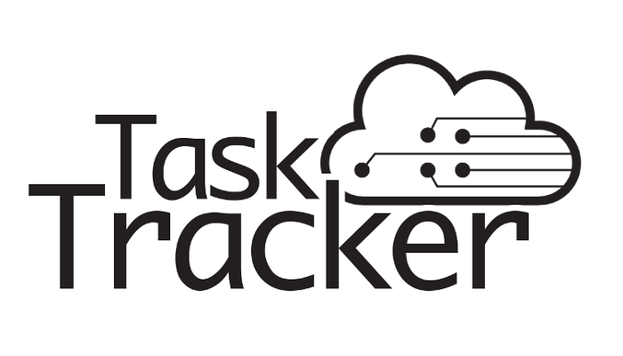

# TaskTracker

[TaskTracker](https://opendevtools.org/) TaskTracker is a project management service for software development teams. 

## Preview

**[View Live Preview](https://opendevtools.org/)**

## Status

Under development...

## Download and Installation

Coming soon!

## Usage

### Basic Usage

After downloading, simply edit the HTML and CSS files included with the template in your favorite text editor to make changes. These are the only files you need to worry about, you can ignore everything else! To preview the changes you make to the code, you can open the `index.html` file in your web browser.

### Advanced Usage

See tutorial

## Bugs and Issues

Have a bug or an issue with this template? [Open a new issue](https://github.com/BlackrockDigital/startbootstrap-sb-admin/issues) here on GitHub or leave a comment on the [template overview page at Start Bootstrap](http://startbootstrap.com/template-overviews/sb-admin/).

## Custom Builds

Contact OpenDevTools

## About

The TaskTracker website will allow users to create development teams and projects under each team. Tasks that are associated with each project will be assigned to members of that project’s team. Users can update their assigned tasks with comments and mark tasks as complete. Tasks can be further validated by a member of a Quality Assurance team. Metrics from each project are aggregated to provide helpful graphs and statistics to project administrators.

